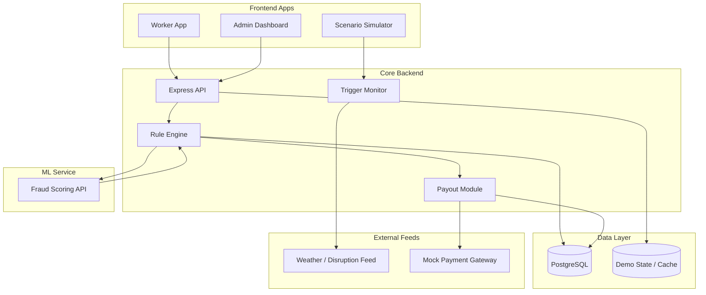

# GigShield: Automated Income Protection for Delivery Workers

> **[Pitch Deck — Final DEVTrails 2026 Presentation](https://docs.google.com/presentation/d/1gU71zUILfgao9iSAmbHQcoYcVA3Bb-fwnZ8t8PcOhic/edit?usp=sharing)**  
> **[Demo Video — 5-Minute Technical Walkthrough](PASTE_PUBLIC_DEMO_VIDEO_LINK_HERE)**

GigShield is a parametric income-protection platform built for food and grocery delivery workers. It protects riders against verified external disruptions such as heavy rain, severe pollution, floods, and local curfews that reduce working hours and cause immediate wage loss. The platform combines a deterministic parametric rule engine with an ML-based fraud scoring service to enable transparent claim automation, simulated instant payouts, and intelligent worker/admin dashboards.[file:3]

---

## Table of Contents
- [The Problem](#the-problem)
- [Our Persona](#our-persona)
- [Why Parametric Insurance](#why-parametric-insurance)
- [How GigShield Works](#how-gigshield-works)
- [Platform Intelligence: Rules + ML](#platform-intelligence-rules--ml)
- [Key Features](#key-features)
- [Dashboards](#dashboards)
- [Architecture](#architecture)
- [Phase 3 Highlights](#phase-3-highlights)
- [Local Setup](#local-setup)
- [Demo Flow](#demo-flow)
- [Limitations](#limitations)
- [Future Work](#future-work)
- [Pitch Deck](#pitch-deck)
- [Demo Video](#demo-video)
- [Repository Access](#repository-access)
- [Tech Stack](#tech-stack)

---

## The Problem

Delivery workers depend on daily income. When a disruption such as a monsoon flood, extreme pollution, or a sudden curfew hits their operating zone, they lose working hours and immediate earnings. Traditional insurance does not solve this problem because it is built for accidents, health, or long claim cycles, not for income loss caused by external disruption.[file:3]

## Our Persona

**Raj** is a full-time Zomato rider in Bangalore earning around ₹800 per day. When heavy rain floods his delivery zone, he cannot work and loses income instantly, while his living costs continue. GigShield is designed for workers like Raj who need fast, simple, weekly protection that matches how they actually earn.[file:3]

---

## Why Parametric Insurance

Parametric insurance works well here because payout is based on a verified trigger rather than a manual loss assessment. That makes the experience faster, more transparent, and easier to demo with real or simulated disruption data.[file:3]

GigShield uses:
- Weekly pricing to match the gig-worker cash-flow cycle.
- Automated disruption triggers from public or mock data feeds.
- Zero-touch claim initiation when a trigger is met.
- Simulated instant payout to the worker wallet after validation.[file:3]

---

## How GigShield Works

1. A worker signs up and selects a weekly cover plan.
2. The system evaluates local risk and sets a weekly premium.
3. The trigger engine monitors weather or disruption conditions.
4. If a covered event occurs, a claim is created automatically.
5. The fraud engine scores the claim for spoofing or suspicious behavior.
6. Low-risk claims are approved and sent to payout simulation.
7. The worker wallet updates instantly and the dashboards refresh.[file:3]

---

## Platform Intelligence: Rules + ML

GigShield does not overclaim “AI.” Instead, it separates reliable business logic from ML-based scoring.

### Deterministic Rule Engine
The core parametric payout logic is rule-based for transparency. Example: if rainfall crosses the configured threshold in the worker’s zone, the trigger fires and a claim is initiated. This makes the coverage easy to explain and audit.[file:3]

### ML Fraud Detection Service
Fraud detection is handled by a lightweight ML service built for practical hackathon use. The service scores claim telemetry such as GPS consistency, zone match, activity pattern, and historical claim behavior, then returns a fraud score used for auto-approval or manual review.[file:3]

### Honest AI Positioning
- **Rule engine** = coverage trigger and payout logic.
- **ML service** = fraud/anomaly scoring.
- **Dashboard predictions** = risk insights for insurers, not guaranteed forecasts.[file:3]

---

## Key Features

- **Weekly premium model** aligned with gig-worker cash flow.
- **Optimized onboarding** for delivery-worker personas.
- **Coverage policy management** for weekly active plans.
- **Automated parametric triggers** for disruptions like rain, pollution, and curfew.
- **Fraud detection** for GPS spoofing, duplicate claims, and suspicious activity.
- **Simulated instant payout** through a mock or sandbox payment rail.
- **Worker dashboard** showing protected earnings, weekly coverage, and payout history.
- **Admin dashboard** showing loss ratios, claims analytics, fraud alerts, and trigger trends.[file:3]

---

## Dashboards

### Worker Dashboard
The worker view shows active weekly coverage, protected earnings, trigger history, claim status, and payout updates. It is designed to make the value of the policy obvious in one glance.[file:3]

### Admin Dashboard
The insurer/admin view shows claim volumes, fraud scores, loss ratios, disruption patterns, and next-week risk indicators. This is the control center for monitoring portfolio health and reviewing suspicious claims.[file:3]

---

## Architecture

| Layer | Technology |
| --- | --- |
| Worker & Admin UI | React, TypeScript, Tailwind CSS, Recharts |
| Core API | Node.js, Express |
| Data Layer | PostgreSQL |
| ML Fraud Service | Python, FastAPI, scikit-learn |
| Payment Flow | Mock / sandbox payout rail |
| Trigger Inputs | Public APIs or simulated disruption feeds |




## Phase 3 Highlights

GigShield was upgraded for the final Phase 3 submission with:
- Advanced fraud detection for delivery-specific abuse patterns.
- Simulated instant payouts for clear demo flow.
- A scenario simulator to trigger fake disruptions live.
- Worker and insurer dashboards for clear judging visibility.
- Honest separation of deterministic logic and ML-based scoring.[file:3]

---

## Local Setup

### Requirements
- Node.js 18+
- Python 3.10+ for the ML service
- PostgreSQL
- Docker optional

### Run the project

```bash
# Frontend
cd frontend
npm install
npm run dev
```

```bash
# Backend
cd backend
npm install
npm run dev
```

```bash
# ML Fraud Service
cd ml-service
pip install -r requirements.txt
uvicorn main:app --reload
```

If you use Docker locally, start the database and supporting services first, then run the frontend, backend, and ML service in separate terminals.

---

## Demo Flow

The final demo shows:
1. Worker onboarding.
2. Weekly policy purchase.
3. Simulated rain or pollution disruption.
4. Automatic claim creation.
5. ML fraud scoring.
6. Instant payout simulation.
7. Dashboard refresh for worker and admin views.[file:3]

---

## Limitations

- External disruption feeds may be simulated for the demo.
- Instant payout is a mock or sandbox flow, not a real money transfer.
- Fraud scoring is lightweight and designed for hackathon-scale demonstration.
- Predictive analytics are best treated as decision support, not guaranteed forecasts.[file:3]

---

## Future Work

- Replace mock feeds with production weather and disruption APIs.
- Improve ML models with larger historical datasets.
- Add stronger payout integration with a real payment gateway.
- Expand to more delivery personas and cities.
- Add deeper explainability for fraud and risk scoring.[file:3]

---

## Pitch Deck

**Public link:** `https://docs.google.com/presentation/d/1gU71zUILfgao9iSAmbHQcoYcVA3Bb-fwnZ8t8PcOhic/edit?usp=sharing`

## Demo Video

**Public link:** `PASTE_PUBLIC_DEMO_VIDEO_LINK_HERE`

---

## Repository Access

- Public Git repository: `PASTE_GIT_REPO_LINK_HERE`
- Hosted demo: `PASTE_HOSTED_DEMO_LINK_HERE`

---

## Tech Stack

- React + TypeScript
- Vite
- Tailwind CSS
- Node.js + Express
- PostgreSQL
- Python + FastAPI
- scikit-learn
- Recharts

---

*Built for Guidewire DEVTrails 2026. Data shown in the demo may be simulated for presentation purposes.*
