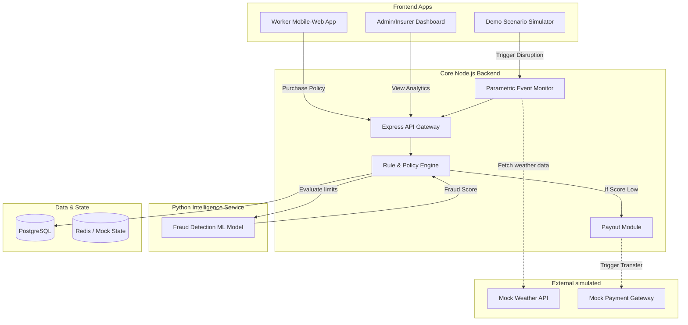

# GigShield: Automated Income Protection for Delivery Workers

> **[Pitch Deck — View Our Final DEVTrails 2026 Presentation here](#)** (Replace with actual link)  
> **[Demo Video — Watch the 5-Minute Technical Walkthrough here](#)** (Replace with actual link)

GigShield is a data-driven parametric insurance platform designed exclusively for food and grocery delivery riders (Zomato/Swiggy/Zepto). We protect them against income loss caused by verified external disruptions like **heavy rain, severe pollution, and local curfews**.

## ⚠️ The Problem & Our Persona

**Raj** is a full-time Zomato rider in Bangalore making ₹800/day.  
When heavy monsoons flood his delivery zone, Raj cannot work. **He loses 100% of his daily income**, while his bike EMI, rent, and fuel costs continue. Traditional insurance only covers accidents or health—it offers zero protection for weather-driven wage loss. Even if it did, the 30-day claims process is unworkable for gig workers who need cash *today*.

## 🚀 The GigShield Solution: Parametric Micro-Insurance

GigShield solves this by removing the human adjuster entirely. We use **conditional logic tied to public data APIs** to automatically trigger payouts.

### The 3 Pillars of GigShield
1. **Weekly Pricing Model**: Gig workers earn weekly, so our pricing fits their cash flow (e.g., ₹49/week).
2. **Data-Driven Triggers**: We monitor OpenWeatherMap and CPCB APIs. If Rain > 15mm/hr in Raj's zone, the policy is triggered.
3. **Instant Payouts**: Zero paperwork. The moment a disruption is verified, the system transfers the lost wages directly to the worker's wallet.

---

## 🧠 Platform Intelligence: Rules + ML

In Phase 3, we transitioned from generic "AI" to a highly practical, honest architecture combining deterministic rules for reliability with Machine Learning for fraud defense.

### 1. Deterministic Rule Engine (Node.js)
Payouts must be transparent. Our core engine uses strict threshold rules (e.g., `Rainfall > 60mm`) to guarantee fair and predictable payouts without black-box logic.

### 2. ML Fraud Detection Service (Python FastAPI + scikit-learn)
Location spoofing is the #1 threat to gig platforms.
Before any parametric payout is authorized, the claim telemetry (GPS confidence, zone distance, activity correlation) is shipped to our **Machine Learning Classification Service**.
- We use a localized `RandomForestClassifier` to generate a real-time anomaly score.
- **Auto-Approval**: If the fraud score is low (< 0.3), the payout fires instantly.
- **Manual Review**: If the score is high, it is routed to the Admin Dashboard for inspection.

---

## ⚙️ Tech Stack & Architecture

| Component | Technology |
| --- | --- |
| **Worker & Admin UI** | React (TS), Tailwind, Recharts, Vite |
| **Core API & Rule Engine** | Node.js, Express, PostgreSQL |
| **Fraud ML Microservice** | Python, FastAPI, scikit-learn |



---

## 🏆 Phase 3 Implementations for DEVTrails

- **Honest AI Service**: Extracted fraud scoring into a dedicated Python microservice.
- **Demo Scenario Simulator**: A dedicated admin panel enabling judges/presenters to instantly fire mock weather events and watch the ML and Payout systems react in real-time.
- **Worker Wallet UI**: Completes the loop by showing instant, transparent payouts on the mobile web view.

---

## 🛣️ Local Setup & Evaluation

The platform is designed to be easily reproducible for judging.

### Requirements
- Node.js 18+
- Python 3.10+ (for ML service)
- PostgreSQL
- Docker (optional)

### Quick Start
1. **Start the DB & Core Services**
```bash
docker-compose up -d
```

2. **Start the Frontend & Backend**
```bash
# Terminal 1: Backend
cd backend && npm install && npm run dev

# Terminal 2: Frontend
cd frontend && npm install && npm run dev

# Terminal 3: ML Fraud Service
cd ml-service && pip install -r requirements.txt && uvicorn main:app --reload
```

---
*Built for Guidewire DEVTrails 2026. Data displayed is for demonstration simulation.*
